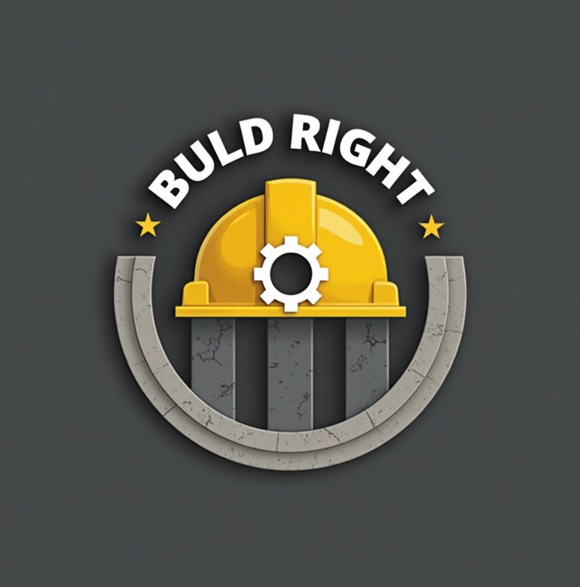

<!-- Improved compatibility of back to top link -->
<a id="readme-top"></a>

<!-- PROJECT SHIELDS -->
 <div align="center">

  <a href="https://github.com/Deeksha-paliwal2004/Construction-Company-Website/graphs/contributors">
    
  </a>
  <a href="https://github.com/Deeksha-paliwal2004/Construction-Company-Website/network/members">
    
  </a>
  <a href="https://github.com/Deeksha-paliwal2004/Construction-Company-Website/stargazers">
    
  </a>
  <a href="https://github.com/Deeksha-paliwal2004/Construction-Company-Website/issues">
    
  </a>
  <a href="https://github.com/Deeksha-paliwal2004/Construction-Company-Website/blob/main/LICENSE.txt">
    


</div>

<!--[![LinkedIn][linkedin-shield]][linkedin-url]-->

<!-- PROJECT LOGO -->
<br />
<div align="center">
  <a href="https://github.com/Deeksha-paliwal2004/Construction-Company-Website">
    
  </a>

  <h3 align="center">Construction Company Website</h3>

  <p align="center">
    A professional responsive website for showcasing construction services and projects!
    <br />
    <a href="https://github.com/Deeksha-paliwal2004/Construction-Company-Website"><strong>Explore the docs »</strong></a>
    <br />
    <br />
    <a href="https://Deeksha-paliwal2004.github.io/Construction-Company-Website">View Demo</a>
    ·
    <a href="https://github.com/Deeksha-paliwal2004/Construction-Company-Website/issues/new?labels=bug&template=bug-report---.md">Report Bug</a>
    ·
    <a href="https://github.com/Deeksha-paliwal2004/Construction-Company-Website/issues/new?labels=enhancement&template=feature-request---.md">Request Feature</a>
  </p>
</div>

<!-- rest of your content remains unchanged -->

<!-- MARKDOWN LINKS & IMAGES -->
[contributors-shield]: https://img.shields.io/github/contributors/Deeksha-paliwal2004/Construction-Company-Website.svg?style=for-the-badge
[contributors-url]: https://github.com/Deeksha-paliwal2004/Construction-Company-Website/graphs/contributors
[forks-shield]: https://img.shields.io/github/forks/Deeksha-paliwal2004/Construction-Company-Website.svg?style=for-the-badge
[forks-url]: https://github.com/Deeksha-paliwal2004/Construction-Company-Website/network/members
[stars-shield]: https://img.shields.io/github/stars/Deeksha-paliwal2004/Construction-Company-Website.svg?style=for-the-badge
[stars-url]: https://github.com/Deeksha-paliwal2004/Construction-Company-Website/stargazers
[issues-shield]: https://img.shields.io/github/issues/Deeksha-paliwal2004/Construction-Company-Website.svg?style=for-the-badge
[issues-url]: https://github.com/Deeksha-paliwal2004/Construction-Company-Website/issues
[license-shield]: https://img.shields.io/github/license/Deeksha-paliwal2004/Construction-Company-Website.svg?style=for-the-badge
[license-url]: https://github.com/Deeksha-paliwal2004/Construction-Company-Website/blob/main/LICENSE.txt
[linkedin-shield]: https://img.shields.io/badge/-LinkedIn-black.svg?style=for-the-badge&logo=linkedin&colorB=555

<!-- 📑 TABLE OF CONTENTS -->
<details open>
  <summary><h2>📚 Table of Contents</h2></summary

├── 📘 About the Project  
│   └── 🔧 Built With  
├── 🚀 Getting Started  
│   ├── 📦 Prerequisites  
│   └── 🔧 Installation  
├── ⚙️ Usage  
├── ✨ Features  
├── 📁 Project Structure  
├── 🛣️ Roadmap  
├── 🤝 Contributing  
├── 📜 License  
├── 📞 Contact  
└── 🙏 Acknowledgments
</details>

---

<!-- ABOUT THE PROJECT -->
## About The Project

[![Website Preview][product-screenshot]](https://Deeksha-paliwal2004.github.io/construction-company)

**BuildRight Construction Company Website** is a modern, responsive web platform created to professionally represent a construction business. It targets potential **clients**, **investors**, and **stakeholders** seeking reliable and quality construction services.

---

#### 🚧 What This Project Offers:

✅ **Professional Design**  
&emsp;→ A clean and modern interface that builds trust with visitors

✅ **Responsive Layout**  
&emsp;→ Works flawlessly across desktops, tablets, and mobile devices

✅ **Interactive Features**  
&emsp;→ Includes smooth scrolling, hover effects, and dynamic elements

✅ **Project Showcase**  
&emsp;→ Organized gallery displaying both commercial and residential projects

✅ **Contact Integration**  
&emsp;→ Easy-to-use forms for inquiries and quote requests

---

This project is a complete digital presence for a construction company, built with modern web development practices, intuitive user experience, and a strong visual identity.

> ⭐ _It’s not just a site — it’s a statement of trust, quality, and capability._
<!-- <p align="right">(<a href="#readme-top">back to top</a>)</p> -->
---

### Built With

This section lists the major frameworks and technologies used to bootstrap this project.

* [![HTML5][HTML5.com]][HTML5-url]
* [![CSS3][CSS3.com]][CSS3-url]
* [![JavaScript][JavaScript.com]][JavaScript-url]
<!--* [![Bootstrap][Bootstrap.com]][Bootstrap-url] -->

<!-- <p align="right">(<a href="#readme-top">back to top</a>)</p> -->

<!-- GETTING STARTED -->
---

## Getting Started

This is a static website that requires no special software to run. Follow these simple steps to get a local copy up and running.

---

### Prerequisites

You only need a modern web browser to view this website:
* Google Chrome (recommended)
* Mozilla Firefox
* Microsoft Edge
* Safari

---

### 🔧 Installation

1. Clone the repository
   ```sh
   git clone https://github.com/Deeksha-paliwal2004/Construction-Company-Website.git
   ```
2. Navigate to the project directory
   ```sh
   cd Construction-Company-Website
   ```
3. Open the project in your code editor
   ```sh
   code .
   ```
4. Run `index.html` in your browser

Or visit the live version:  
👉 https://Deeksha-paliwal2004.github.io/Construction-Company-Website

<!-- <p align="right">(<a href="#readme-top">back to top</a>)</p> -->

<!-- 🚀 USAGE EXAMPLES -->
---

## 🚀 How to Use This Website

This construction company website is designed with **ease of navigation**, **visual appeal**, and **user experience** in mind. Here’s a walkthrough of each core section:

---

### 🏠 Home Page
🎯 **First Impressions Matter!**  
- Bold hero section with company branding  
- Catchy headings and high-impact visuals  
- Call-to-action buttons like _“Explore Projects”_ and _“Get in Touch”_

---

### 🧱 About Section
👷‍♀️ **Who We Are**  
- Learn about the company’s mission, experience, and achievements  
- Professionally crafted layout to build trust and credibility

---

### 🛠️ Services Page
🧰 **What We Do**  
- Cleanly listed construction-related services  
- Each service block is styled for clarity and quick scanning  
- Future scope for animations or CMS integration

---

### 🖼️ Projects Gallery
🏗️ **Our Work Speaks**  
- Showcases completed residential & commercial projects  
- Interactive gallery with filtering options  
- Powered by structured JSON data for flexibility

---

### 📬 Contact Form
📩 **Let’s Build Something Together**  
- Simple, elegant form with real-time input validation  
- Easy for clients to inquire directly from the site  
- Designed with user trust and responsiveness in mind

---

🔧 **Want to customize this?**  
Feel free to [edit the README](https://github.com/Deeksha-paliwal2004/Construction-Company-Website/edit/main/README.md) or personalize the content for your brand/client.

<!-- <p align="right">(<a href="#readme-top">back to top</a>)</p> -->
<!-- ✨ FEATURES -->

---

## ✨ Features

| 🚀 Feature                         | 💡 Description                                                                 |
|----------------------------------|------------------------------------------------------------------------------|
| 📱 **Responsive Design**          | Mobile-first approach ensuring perfect layout across all devices.            |
| 🎨 **Modern UI/UX**               | Clean, sleek interface with smooth animations and intuitive design.          |
| 🖼️ **Project Gallery**             | Dynamic display of completed works with filtering (residential/commercial). |
| 🧠 **Interactive Elements**        | Hover effects, smooth scrolling, and smart form validation.                  |
| 📬 **Contact Integration**         | Functional form with client-side validation to keep users connected.         |
| 🔍 **SEO Optimized**              | Semantic HTML and structured meta tags improve search engine visibility.     |
| ⚡ **Fast Loading**               | Minified CSS/JS and optimized images ensure speedy performance.              |

<!-- <p align="right">(<a href="#readme-top">back to top</a>)</p> -->
<!-- PROJECT STRUCTURE -->
---

## Project Structure

```
construction-company/
├── index.html                 # Main homepage
├── indexes/
│   ├── projects.html         # Projects gallery page
│   └── service.html          # Services page
├── styles/
│   ├── home.css             # Homepage styles
│   ├── projects.css         # Projects page styles
│   └── service.css          # Services page styles
├── scripts/
│   ├── home.js              # Homepage functionality
│   ├── projects.js          # Projects page functionality
│   └── service.js           # Services page functionality
├── data/
│   ├── project_detail.json  # Complete project information
│   ├── projects_comm.json   # Commercial projects data
│   └── projects_res.json    # Residential projects data
└── README.md                # Project documentation
```

<!-- <p align="right">(<a href="#readme-top">back to top</a>)</p> -->

<!-- 🛣️ ROADMAP -->
---

## 🛣️ Roadmap

Here’s a look at our development journey — what’s done ✅ and what’s coming up 🔧:

### ✅ Completed
- [x] 🏗️ Basic HTML structure with responsive design
- [x] 🏠 Home page with hero section and functional contact form
- [x] 🖼️ Projects gallery integrated with JSON data
- [x] ✨ Smooth CSS animations and interactive UI elements

### 🚧 In Progress / Planned
- [ ] 🛎️ Complete services page with detailed content
- [ ] 🔍 Add dynamic project filtering and keyword search
- [ ] 📤 Backend processing for contact form (PHP/Node planned)
- [ ] 💬 Add testimonials & client reviews carousel
- [ ] 📝 Integration with CMS for easier content updates
- [ ] ⚙️ Performance tuning and advanced SEO enhancements
- [ ] 🌐 Multi-language support:
  - [ ] 🇮🇳 Hindi
  - [ ] 🗣️ Regional languages (Marathi, Tamil, etc.)

📌 See the [open issues](https://github.com/your-username/construction-company/issues) for more ideas and known bugs!

<!-- <p align="right">(<a href="#readme-top">back to top</a>)</p> -->
<!-- CONTRIBUTING -->

---

## 🤝 Contributing

Contributions are what make the open-source community such a wonderful place to learn, inspire, and build together.  
Any contributions you make are **greatly appreciated** and will help improve this project.

If you have suggestions or improvements, feel free to:

- ⭐ Fork the repository  
- 🛠️ Create a feature branch  
- 📦 Make your changes  
- 🚀 Push the branch  
- 📬 Open a pull request

Don’t forget to give the project a ⭐ if you found it helpful!

---

### 🔧 How to Contribute

1. **Fork** the repository  
2. **Create** a feature branch:
   ```bash
   git checkout -b feature/AmazingFeature
3. Commit your changes:
   ```bash
   git commit -m "Add AmazingFeature"
4. Push to the branch:
   ```bash
   git push origin feature/AmazingFeature
5. Open a Pull Request and describe your changes

---

### Team Members

<!--<a href="https://github.com/Deeksha-paliwal2004/Construction-Company-Website/graphs/contributors">
  
</a>

---

### 🙌 Team Contributors
--->
| Name               | GitHub Profile |
|--------------------|----------------|
| Deeksha Paliwal    | [@Deeksha](https://github.com/Deeksha-paliwal2004) |
| Ariya Sri          | [@Ariya](https://github.com/ariya10) |
| Gunapu Sahithi     | [@Sahithi](https://github.com/sahithi3005) |
| Mahesh More        | [@Mahesh](https://github.com/Mahesh-more1) |
| Sanskruti Kumbhare | [@Sanskruti](https://github.com/Sanskruti100) |
| Uddanti Bhavana    | [@Bhavana](https://github.com/UddantiBhavana) |

---

<!-- <p align="right">(<a href="#readme-top">back to top</a>)</p> -->

<!-- LICENSE -->
## License

Distributed under the MIT License. See `LICENSE.txt` for more information.

<!-- <p align="right">(<a href="#readme-top">back to top</a>)</p> -->
---

<!-- CONTACT -->
## 📞 Contact

We’d love to hear from you! Feel free to reach out for **collaborations**, **feedback**, or **contributions**.

- 🛠️ **Project Team**: [@construction_team](https://twitter.com/construction_team)  
- 📧 **Email**: [team@constructioncompany.com](mailto:team@constructioncompany.com)  
- 💻 **GitHub Repository**: [https://github.com/Deeksha-paliwal2004/construction-company](https://github.com/Deeksha-paliwal2004/construction-company)  
- 🌐 **Live Demo**: [https://Deeksha-paliwal2004.github.io/construction-company](https://Deeksha-paliwal2004.github.io/construction-company)

<!-- <p align="right">(<a href="#readme-top">back to top</a>)</p> -->
---

<!-- ACKNOWLEDGMENTS -->
## Acknowledgments

Use this space to list resources you find helpful and would like to give credit to. I've included a few of our favorites to kick things off!

* [Choose an Open Source License](https://choosealicense.com)
* [GitHub Emoji Cheat Sheet](https://www.webpagefx.com/tools/emoji-cheat-sheet)
* [Malven's Flexbox Cheatsheet](https://flexbox.malven.co/)
* [Malven's Grid Cheatsheet](https://grid.malven.co/)
* [Img Shields](https://shields.io)
* [GitHub Pages](https://pages.github.com)
* [Font Awesome](https://fontawesome.com)
* [Unsplash](https://unsplash.com) - For high-quality construction images
* [Google Fonts](https://fonts.google.com)
<!--* [Bootstrap Documentation](https://getbootstrap.com/docs/)-->

<p align="right">(<a href="#readme-top">back to top</a>)</p>

<!-- MARKDOWN LINKS & IMAGES -->
<!-- https://www.markdownguide.org/basic-syntax/#reference-style-links -->
[contributors-shield]: https://img.shields.io/github/contributors/your-username/construction-company.svg?style=for-the-badge
[contributors-url]: https://github.com/your-username/construction-company/graphs/contributors
[forks-shield]: https://img.shields.io/github/forks/your-username/construction-company.svg?style=for-the-badge
[forks-url]: https://github.com/your-username/construction-company/network/members
[stars-shield]: https://img.shields.io/github/stars/your-username/construction-company.svg?style=for-the-badge
[stars-url]: https://github.com/your-username/construction-company/stargazers
[issues-shield]: https://img.shields.io/github/issues/your-username/construction-company.svg?style=for-the-badge
[issues-url]: https://github.com/your-username/construction-company/issues
[license-shield]: https://img.shields.io/github/license/your-username/construction-company.svg?style=for-the-badge
[license-url]: https://github.com/your-username/construction-company/blob/master/LICENSE.txt
[linkedin-shield]: https://img.shields.io/badge/-LinkedIn-black.svg?style=for-the-badge&logo=linkedin&colorB=555
[linkedin-url]: https://linkedin.com/in/your-linkedin
[product-screenshot]: images/screenshot.png
[HTML5.com]: https://img.shields.io/badge/HTML5-E34F26?style=for-the-badge&logo=html5&logoColor=white
[HTML5-url]: https://html.spec.whatwg.org/
[CSS3.com]: https://img.shields.io/badge/CSS3-1572B6?style=for-the-badge&logo=css3&logoColor=white
[CSS3-url]: https://www.w3.org/Style/CSS/
[JavaScript.com]: https://img.shields.io/badge/JavaScript-F7DF1E?style=for-the-badge&logo=javascript&logoColor=black
[JavaScript-url]: https://developer.mozilla.org/en-US/docs/Web/JavaScript
<!--[Bootstrap.com]: https://img.shields.io/badge/Bootstrap-563D7C?style=for-the-badge&logo=bootstrap&logoColor=white
[Bootstrap-url]: https://getbootstrap.com-->
